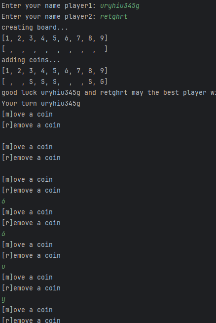
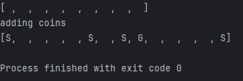
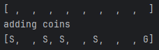

# Plan for Testing the Program

The test plan lays out the actions and data I will use to test the functionality of my program.

Terminology:

- **VALID** data values are those that the program expects
- **BOUNDARY** data values are at the limits of the valid range
- **INVALID** data values are those that the program should reject

---

## Names

seeing if player Names are working

### Test Data To Use

Details of test data and reasons for selection. Details of test data and reasons for selection. Details of test data and reasons for selection.

### Expected Test Result

what should happen is the players should be
able to input their names weather or not it has 
numbers in it or just numbers or letters 

 It does what I want it to do right now 

## The game

Im testing to see if the game bord has been printed 
with numbers in most slots representing a different coin 
G= gold S= sliver and the sliver randomly ladout and gold is in the 8 place

### Test Data To Use
It is printing a second board but it doesn't have any coins in it  

Now it's worked but it added 4 new slots to the game

### Expected Test Result

what should happen is the Game should randomes the sliver slots add a gold coin on the 9 slot and not
add any more slots
### Fixed resalt
I have fixed it I did change it so it would delated a space that wasn't a coin once one was added
and then added the gold coin on the end.

## Name 
getting 2 player to work/taking turns 