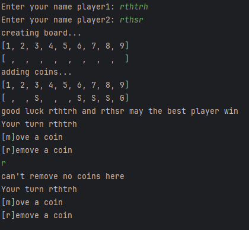

# Plan for Testing the Program

The test plan lays out the actions and data I will use to test the functionality of my program.

Terminology:

- **VALID** data values are those that the program expects
- **BOUNDARY** data values are at the limits of the valid range
- **INVALID** data values are those that the program should reject

---

## Names

seeing if player Names are working

### Test Data To Use

running the program and putting in player names

### Expected Test Result

what should happen is the players should be
able to input their names weather or not it has 
numbers in it or just numbers or letters 

 It does what I want it to do right now 

## The game

I'm testing to see if the game bord has been printed 
with the coins in 5 slots, gold is put in the 9/last place

### Test Data To Use
I will run the progarm to see if it does what I want it to do

### Expected Test Result

what should happen is the Game should randomes the sliver slots add a gold coin on the 9 slot and not
add any more slots
### Fixed resalt
I have fixed it I did change it, so it would delated a space that wasn't a coin once one was added
and then added the gold coin on the end after delating that space/slot.

## Name 
working on moveing and removeing a coin

## test data To Use
I will run the progarm and enter an input as a player and see what happens

## what happened
the code didn't take the input but somereson it also added 
anough slot t othe game board

I got it to do one of the inputs right (r)
but still working on moving coins 

it's moveing the coin,but it printed a line that it shouldn't of
and if I input r it now removers a coin but then tryes to move a coin

### Fixed resalt 
the game can now remave and move coins around with the player's input

## player's taking turns
 here I will be making sure players can take turns and win the game
 
## test data To Use
players can win and lose the game can be played 

## what happend 
it went as planed as the players can input moves to move coins and win
as long as it's a vailed  input or as long as it's not left blank 

and once the game ends it prints you win (the Player name that won)

## Error checking
testing all the in valided moves and fixing misstakes

## tests data 
selecting bad inputs and seeing what happens
## what happen
I've ensured that coins can't be moved onto one another 

And coins can't be moved over each other

and you can't select an Empty space and must pick on with a coin

and you can't remove a coin from the space if there are no coins

and If you hit any leter or just hitting enter other than using m or r when picking to move or remove
it will just repeat the prompt

