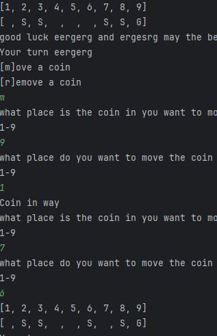

# Plan for Testing the Program

The test plan lays out the actions and data I will use to test the functionality of my program.

Terminology:

- **VALID** data values are those that the program expects
- **BOUNDARY** data values are at the limits of the valid range
- **INVALID** data values are those that the program should reject

---

## Names

seeing if player Names are working

### Test Data To Use

Details of test data and reasons for selection. Details of test data and reasons for selection. Details of test data and reasons for selection.

### Expected Test Result

what should happen is the players should be
able to input their names weather or not it has 
numbers in it or just numbers or letters 

 It does what I want it to do right now 

## The game

Im testing to see if the game bord has been printed 
with numbers in most slots representing a different coin 
1= gold 2= sliver

### Test Data To Use

Details of test data and reasons for selection. Details of test data and reasons for selection. Details of test data and reasons for selection.

### Expected Test Result

Statement detailing what should happen. Statement detailing what should happen. Statement detailing what should happen. Statement detailing what should happen. 

---

